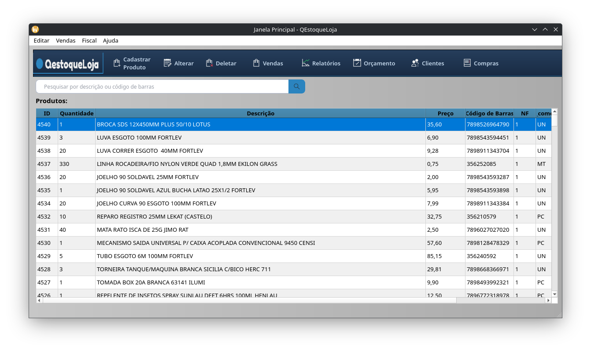
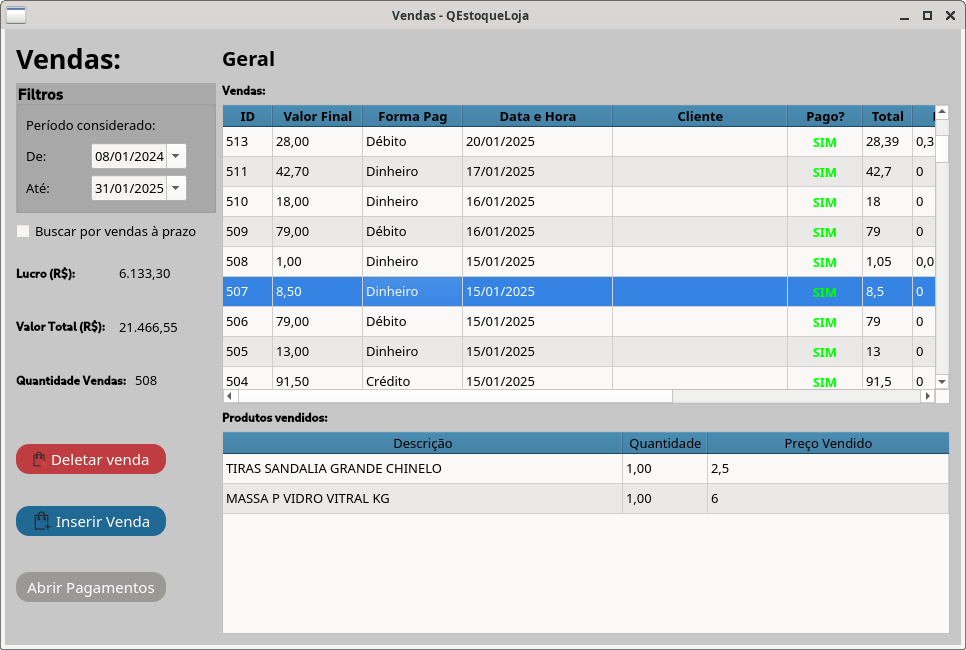
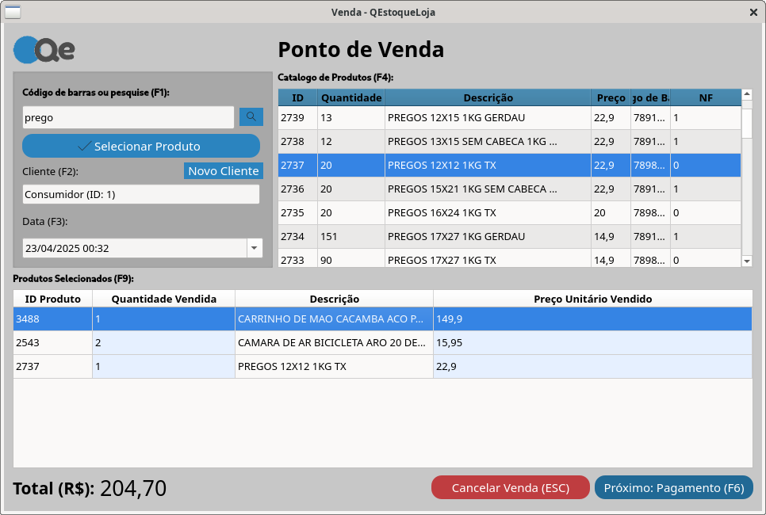
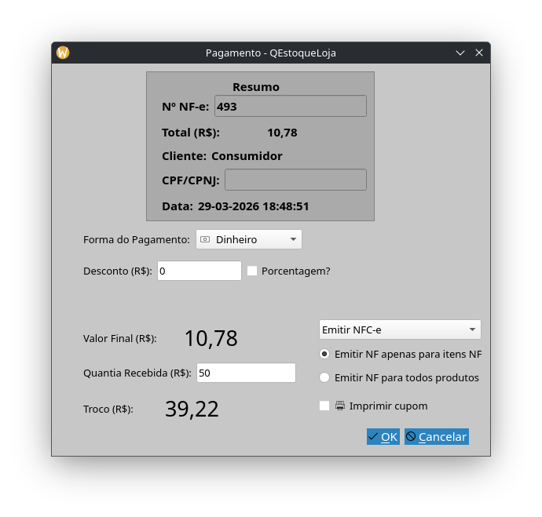
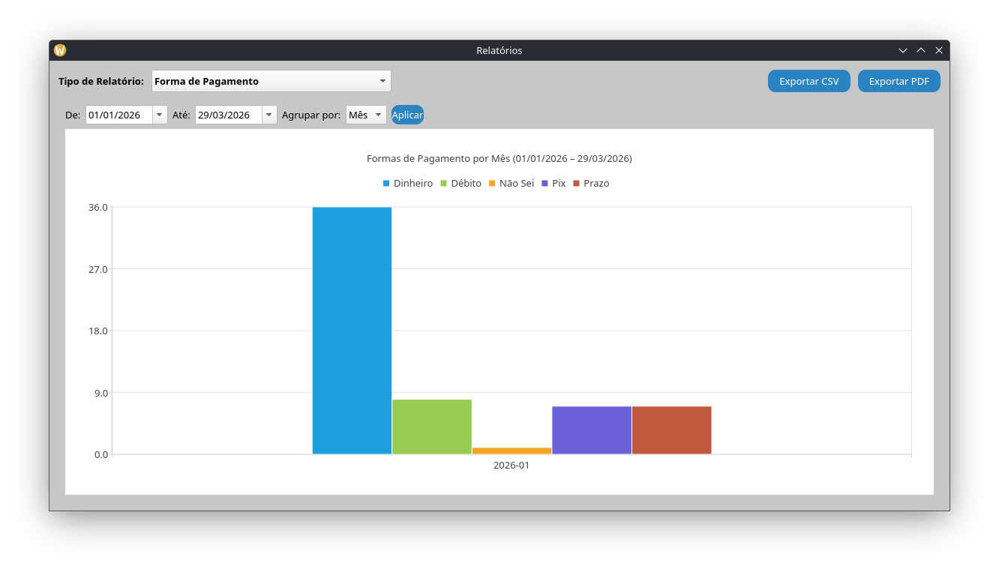
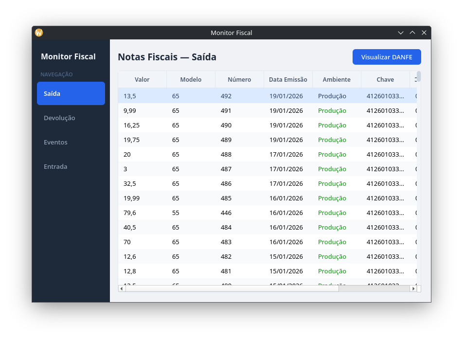

## 📦 Sobre o projeto

O **QEstoqueLoja** é um sistema de controle de estoque gratuito e de código aberto pensado para ser simples e eficiente no dia a dia.

Sem complexidade desnecessária — foco total em registrar, acompanhar e gerenciar produtos de forma rápida.

---

## ⚡ Funcionalidades

- Cadastro de produtos
- Emissão de Nota Fiscal Eletrônica (NF-e) e Nota Fiscal do Consumidor Eletrônica NFC-e para regime Simples Nacional
- Controle de estoque
- Consulta rápida de itens
- Sistema leve e direto
- Ideal para pequenos comércios
- Importação de NF-e automática para o estoque
- Envio de notas por e-email para o cliente e contador
- Ponto de Venda (PDV)
- Importação de informações de cliente por meio do CNPJ
- Separação de produtos com nota e sem nota
- E muito mais

---

## 🚀 Por que usar?

Muitos sistemas de ERP são complexos e difíceis de usar.

O QEstoqueLoja resolve isso com uma proposta simples:
> fazer o essencial bem feito.

Perfeito para:
- Pequenas lojas
- Uso interno
- Quem quer evitar sistemas pesados e complexos

O sistema é gratuito e de código aberto, significando que você pode
testar sem comprometimento, tudo estará sob o seu controle e se você
quiser adicionar uma funcionalidade pode pedir para a comunidade,
fazer você mesmo ou pagar para ser feito.

Outros sistemas comerciais cobram mensalidades e oferecem uma
experiência de uso péssima, onde os usuários acabam não usando 90% das
funções do sistema.

---

## ⬇️ Download

👉 [Baixe a versão mais recente, para Windows ou Linux](/download)

---

## 🛠️ Código aberto

Este projeto é open source e está disponível no GitHub:

👉 https://github.com/GabR36/QEstoqueLoja

Contribuições são bem-vindas!

---

## 📌 Futuro do projeto

- Melhorias de interface
- Novas funcionalidades de gestão
- Otimizações de desempenho

---

## 📬 Contato

Se tiver sugestões ou encontrar problemas, abra uma issue no GitHub.

Ou mande uma mensagem para os autores:

- Gabriel B. Chuede - <gabrielbchuede@gmail.com>
- Rafael B. Chuede - <rafaelbormannc@gmail.com>

## 🖥️ Capturas de tela

